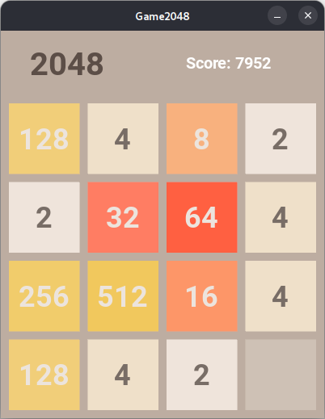

Grid2048 (with AI players)
--------

2048 game grid engine written for fun in Python. It can be used as a library or as a standalone game. It also has a Kivy and PyGame GUI version.



Dependencies:

- Python 3.10+
- NumPy
- PyGame (for GUI version)
- Kivy (for GUI version)
  
## Installation

- Clone the repository: 
  ```
  git clone https://github.com/MicPec/Grid2048.git
  cd Grid2048
  ```

- Install the required dependencies: 

  ```
  uv sync
  ```

- Run the game: 

  ```
  uv run 2048pygame.py
  ```


> You can also acticate virtual environment and run the game from there.
> 
> ```
> source .venv/bin/activate
> python 2048pygame.py
> ```

## Usage

```python
from grid2048 import DIRECTION, Grid2048, MoveFactory

grid = Grid2048(width, height)
move = MoveFactory.create(DIRECTION.UP)
moved = grid.move(move)
if moved:
    # do some staff, show score, etc. 
    print(grid)
    print(grid.score)   

if grid.no_moves():
    grid.reset()
```

## Customization

You can customize the grid size by specifying the `width` and `height` when initializing the `Grid2048` object. For example:

```python
grid = Grid2048(3, 6)  # Creates a 3x6 grid
```

## Players

There is a possibility to add a custom player class. See `players/user_player.py` for example.
In `players.py` module are abstract classes for `Player` and `AIPlayer`. You can implement your own player class by inheriting from them and overriding `play` method.
Few example AI players are included: Monte Carlo Simylation, Monte Carlo Tree Search, Minimax and Expectimax: `mcs`, `mcts` ,`minimax`, `expectimax` respectively.
Evaluation functions still need to be improved, but it's a good start.
Also, there is a random player: `random` and `cycle` player that cycle through directions.

## Play

There are three simple game examples:

- 2048.py - CLI version, use `u`, `d`, `l`, `r` keys.
- 2048kivy.py - GUI version using [Kivy](https://kivy.org), use the arrow keys.
- 2048pygame.py - GUI version using [Pygame](https://www.pygame.org), use the arrow keys.

The default player is `user`, but you can change it by passing `-p` argument. For example:

To run mcts player:

```bash
uv run ./2048.py -p mcts
```

or

```bash
uv run ./2048pygame.py -p mcts -fps 10 
```

where `-fps` is the maixmum number of frames/moves per second.
You can also pause the game by pressing `space` key, and move step by step by pressing `enter` key.

Also, you can set the width and height of the grid:

```bash
uv run ./2048.py --rows 3 --cols 6
```

Also, you can conut the statistics of the player by running:

```bash
uv run ./2048stats.py -p mcs
```

Default game speed is set to 10, but you can change it by passing `-i` argument.


Have fun ;)